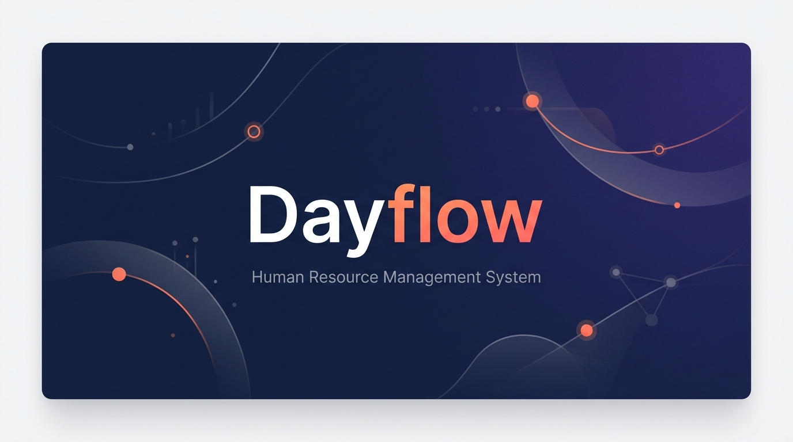

<p align="center">
  
</p>

<p align="center">
  <strong>A modern, full-stack Human Resource Management System built for the cloud.</strong>
</p>

<p align="center">
  <a href="#features">Features</a> •
  <a href="#tech-stack">Tech Stack</a> •
  <a href="#architecture">Architecture</a> •
  <a href="#getting-started">Getting Started</a> •
  <a href="#project-structure">Project Structure</a> •
  <a href="#team">Team</a>
</p>

---

## Overview

**Dayflow** is a comprehensive Human Resource Management System (HRMS) designed for small-to-medium businesses. It streamlines employee lifecycle management — from onboarding and attendance tracking to leave management, payroll processing, and workforce analytics — all within a single, elegant web application.

Built as part of an 8-hour hackathon, Dayflow demonstrates production-grade architecture with role-based access control, real-time database integration, and a custom design system — without relying on heavy component libraries.

---

## Features

### 🔐 Authentication & Access Control
- Secure login with Login ID + temporary password flow
- Role-based access control (Admin / Employee)
- Route-level protection with automatic redirects
- Supabase Auth integration with Row Level Security (RLS)

### 👥 Employee Management
- **Employee Directory** — searchable, filterable card grid with live attendance status badges
- **Employee Profiles** — tabbed detail view (Basic Info, Private Info, Salary, Attendance History, Time Off)
- **Profile Images** — avatar rendering with `profile_image_url` support, initials fallback
- Auto-generated Login IDs (`FIRST3 + LAST3 + JOIN_YEAR + SERIAL`)

### 📋 Attendance Tracking
- Daily check-in / check-out with timestamps
- Automatic work-hours and overtime calculation
- Status tracking: Present, Half-day, Absent, On Leave
- Historical attendance log per employee

### 🏖️ Time Off / Leave Management
- Leave request submission with type selection (PTO, Sick, Unpaid)
- Medical document attachment upload for Sick Leave (Supabase Storage)
- Admin approval/rejection workflow with comments
- Leave allocation balances and usage tracking
- Overlap detection and date validation

### 💰 Payroll & Compensation
- **Admin View** — company-wide payroll summary with department-level Recharts visualizations
- **Employee View** — read-only monthly salary breakdown (Basic, HRA, PF, PT, Gross, Net)
- Salary structure editing with live preview via `v_employee_salary_components` database view
- Indian payroll components: Basic, HRA, Standard Allowance, Performance Bonus, LTA, PF, Professional Tax

### 📊 Analytics Dashboard
- Attendance volume trends (7-day / 30-day range selector)
- Leave request distribution by status and type (Pie charts)
- Gross payroll allocation by department (Bar charts)
- All charts powered by Recharts with responsive containers

### 🖥️ Admin Dashboard
- Real-time workforce metrics: headcount, present today, on leave, pending requests
- 7-day attendance trend chart
- Approved leave type distribution
- Pending time-off request preview table with quick navigation

---

## Tech Stack

| Layer | Technology |
|---|---|
| **Framework** | [Next.js 16](https://nextjs.org) (App Router, Turbopack) |
| **Language** | TypeScript + React 19 |
| **Database** | [Supabase](https://supabase.com) (PostgreSQL) |
| **Auth** | Supabase Auth with RLS policies |
| **Storage** | Supabase Storage (private buckets for leave attachments) |
| **Charts** | [Recharts](https://recharts.org) |
| **Styling** | Custom CSS design system (`globals.css`) — no Tailwind runtime |
| **Design** | Handcrafted component library (`SharedAtoms.tsx`) |

---

## Architecture

```
┌─────────────────────────────────────────────────────────┐
│                     Next.js App Router                  │
│                                                         │
│  ┌──────────┐  ┌──────────┐  ┌──────────┐  ┌────────┐  │
│  │  Admin   │  │ Employee │  │  Payroll │  │  Auth  │  │
│  │Dashboard │  │Directory │  │  Module  │  │ Guard  │  │
│  └────┬─────┘  └────┬─────┘  └────┬─────┘  └───┬────┘  │
│       │              │             │             │       │
│  ┌────┴──────────────┴─────────────┴─────────────┴────┐  │
│  │              lib/dayflow-api.ts                    │  │
│  │         (Supabase Client Wrapper Layer)            │  │
│  └────────────────────┬──────────────────────────────┘  │
│                       │                                  │
└───────────────────────┼──────────────────────────────────┘
                        │
              ┌─────────┴─────────┐
              │    Supabase       │
              │  ┌─────────────┐  │
              │  │ PostgreSQL  │  │
              │  │  + RLS      │  │
              │  ├─────────────┤  │
              │  │   Auth      │  │
              │  ├─────────────┤  │
              │  │  Storage    │  │
              │  └─────────────┘  │
              └───────────────────┘
```

---

## Getting Started

### Prerequisites

- **Node.js** ≥ 18
- **npm** ≥ 9
- A [Supabase](https://supabase.com) project with the Dayflow schema applied

### Installation

```bash
# Clone the repository
git clone https://github.com/shashwathnaik-glitch/Dayflow.git
cd Dayflow

# Install dependencies
npm install
```

### Environment Variables

Create a `.env.local` file in the project root:

```env
NEXT_PUBLIC_SUPABASE_URL=https://your-project.supabase.co
NEXT_PUBLIC_SUPABASE_ANON_KEY=your-anon-key
```

### Development

```bash
npm run dev
```

Open [http://localhost:3000](http://localhost:3000) to access the application.

### Production Build

```bash
npm run build
npm start
```

---

## Project Structure

```
Dayflow/
├── app/                          # Next.js App Router pages
│   ├── admin/
│   │   ├── dashboard/page.tsx    # Admin Dashboard (metrics, charts, pending requests)
│   │   ├── employees/page.tsx    # Employee Directory (search, filter, status grid)
│   │   ├── employees/[id]/       # Employee Detail (tabbed profile view)
│   │   └── analytics/page.tsx    # Analytics (attendance, leave, payroll charts)
│   ├── attendance/page.tsx       # Attendance check-in/out
│   ├── dashboard/page.tsx        # Employee self-service dashboard
│   ├── login/page.tsx            # Authentication page
│   ├── payroll/page.tsx          # Payroll (admin summary / employee slip)
│   ├── timeoff/page.tsx          # Leave request management
│   ├── globals.css               # Design system tokens and utilities
│   └── layout.tsx                # Root layout with AuthProvider
│
├── components/
│   ├── AuthProvider.tsx           # Auth context with Supabase listener
│   └── SharedAtoms.tsx            # Reusable UI components (Avatar, Badge, StatCard, Icon, etc.)
│
├── lib/
│   ├── supabaseClient.ts          # Supabase client singleton
│   ├── dayflow-api.ts             # Database query wrapper (employees, attendance, leave, salary)
│   └── dataMappers.ts             # snake_case → camelCase field mapping utilities
│
├── timeoffApi.js                  # Leave request client-side validation and submission
├── dayflow-prototype.jsx          # Full-featured monolithic prototype (reference implementation)
└── package.json
```

---

## Branch Strategy

This project follows a role-based branching model for the hackathon:

| Branch | Owner | Scope |
|---|---|---|
| `main` | Integration | Merged, tested features |
| `Role-1` | Tech Lead | Auth, employee creation, shared architecture |
| `Role-2` | Member 2 | Employee dashboard, attendance services |
| `Role-3` | Member 3 | Time Off / Leave management |
| `Role-4` | Member 4 | Admin Dashboard, Payroll, Analytics |

**Integration order**: Role-2 → Role-3 → Role-4 → main

---

## Design System

Dayflow uses a custom CSS design system defined in `globals.css` with semantic tokens:

| Token | Purpose |
|---|---|
| `--brand-flow` | Primary brand blue |
| `--brand-dawn` | Accent coral/orange |
| `--ink`, `--ink-soft`, `--ink-faint` | Text hierarchy |
| `--success`, `--warn`, `--danger` | Semantic status colors |
| `--line`, `--surface`, `--surface-raised` | Layout surfaces |

Shared components in `SharedAtoms.tsx`:
- `Avatar` — Profile image with initials fallback
- `StatCard` — Metric display with icon and tone
- `Badge` / `AttendanceBadge` / `LeaveStatusBadge` — Status indicators
- `Icon` — SVG icon set (dashboard, users, clock, calendar, wallet, chart, bell, etc.)
- `EmptyState` — Placeholder for empty data sections

---

## Database Schema

Key tables and views:

| Table/View | Purpose |
|---|---|
| `employees` | Employee master data, credentials, and monthly wage |
| `departments` | Department lookup |
| `job_positions` | Role/position lookup |
| `attendance` | Daily check-in/out records with status |
| `leave_requests` | Time-off requests with approval workflow |
| `leave_allocations` | Per-employee leave balance tracking |
| `leave_types` | Leave category definitions (PTO, Sick, Unpaid) |
| `v_employee_salary_components` | Computed salary breakdown view (Basic, HRA, PF, PT, Gross, Net) |

All tables are protected by Supabase Row Level Security (RLS) policies.

---

## Team

Built with ❤️ during an 8-hour hackathon.

| Role | Responsibility |
|---|---|
| **Role-1** (Tech Lead) | Authentication, employee creation, Login ID generation, shared architecture |
| **Role-2** | Employee dashboard, profile views, attendance services |
| **Role-3** | Time Off module, leave request workflows, attachment handling |
| **Role-4** | Admin Dashboard, Employee Directory, Payroll, Analytics |

---

## License

This project was developed as part of a hackathon demonstration. All rights reserved by the respective contributors.

---

<p align="center">
  <sub>Built with Next.js 16 · Supabase · Recharts · TypeScript</sub>
</p>
